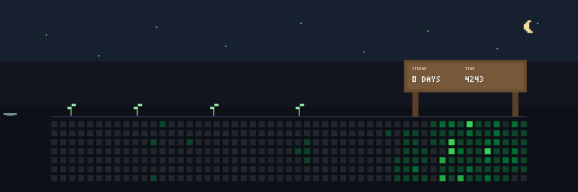

<div align="center">



</div>

# Ube

**Your contribution graph has a tiny resident.**

Ube turns the last 53 weeks of GitHub contributions into a looping pixel scene. The graph stays recognizable, while a small purple character walks above it with a four-frame gait, an occasional blink, and a soft trail of light.

The banner is generated inside GitHub Actions. You do not need to host a service or hand your data to another account.

## Put Ube on your profile

Copy [`ube.config.json`](./ube.config.json) and [`characters/ube.json`](./characters/ube.json) into your profile repository. Change `github.username`, then add this workflow:

```yaml
name: Refresh Ube

on:
  workflow_dispatch:
  schedule:
    - cron: "17 3 * * *"

permissions:
  contents: write

jobs:
  render:
    runs-on: ubuntu-latest
    steps:
      - uses: actions/checkout@v6

      - name: Render Ube
        uses: aldeniaalexandra/ube@main
        with:
          token: ${{ github.token }}

      - name: Commit the banner
        shell: bash
        run: |
          if git diff --quiet -- assets/ube.gif; then
            exit 0
          fi
          git config user.name "github-actions[bot]"
          git config user.email "41898282+github-actions[bot]@users.noreply.github.com"
          git add -- assets/ube.gif
          git commit -m "chore: refresh Ube banner"
          git push
```

Add the generated file to your profile README:

```markdown

```

The example tracks `main` while Ube is in early development. Pin a release tag or commit when you want a fixed version.

## Configuration

```json
{
  "version": 1,
  "github": {
    "username": "aldeniaalexandra"
  },
  "character": "characters/ube.json",
  "output": {
    "path": "assets/ube.gif",
    "width": 960,
    "height": 320,
    "fps": 12.5,
    "durationSeconds": 9.6
  },
  "theme": {
    "background": "#0d1117",
    "gridEmpty": "#21262d",
    "gridLevels": ["#0e4429", "#006d32", "#26a641", "#39d353"],
    "accent": "#8a63e8"
  }
}
```

Paths are resolved from the config file. Canvas sizes from 320 × 160 through 1600 × 800 are supported; the contribution grid scales down cleanly on narrower banners. Invalid colors, dimensions, frame counts, and unknown keys fail with a message that points to the config file and exact field.

## Draw a different resident

The character pack is plain JSON. It contains a palette and six 12 by 8 pixel frames: idle, blink, and four walking poses.

```json
{
  "palette": {
    "P": "#8A63E8",
    "H": "#BFAAFF",
    "S": "#6845C6",
    "E": "#171225"
  }
}
```

Each visible letter paints one color. A space stays transparent. Edit the matrices in [`characters/ube.json`](./characters/ube.json) to change the silhouette or gait. The loader rejects uneven rows and undeclared symbols before rendering anything.

## Run it locally

Ube needs Node.js 20 or newer.

```bash
npm ci
npm run typecheck
npm test
npm run build
```

Generate the deterministic demo banner without contacting GitHub:

```bash
node dist/cli.js generate \
  --config ube.config.json \
  --fixture tests/fixtures/calendar.json
```

For live data, set `GITHUB_TOKEN` and omit `--fixture`.

## How it works

```text
GitHub GraphQL
      ↓
53 × 7 contribution calendar
      ↓
deterministic walk timeline
      ↓
indexed-pixel renderer
      ↓
looping GIF
```

The renderer, character format, Ube artwork, motion system, configuration schema, and GitHub adapter live in this repository. [`gifenc`](https://github.com/mattdesl/gifenc) is the only runtime image dependency. It serializes the indexed frames that Ube has already drawn.

The same engine powers the CLI and the JavaScript Action. Fixture mode never touches the network, which keeps visual tests stable and makes every generated frame reproducible.

## Privacy and permissions

Ube requests contribution dates, counts, and intensity levels from GitHub GraphQL. It does not collect telemetry or store your token. The Action only writes the GIF; the workflow above decides whether to commit it.

## License

MIT. See [`LICENSE`](./LICENSE).
